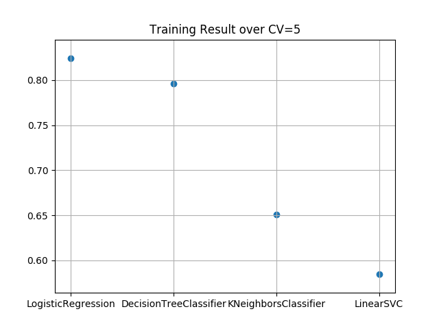
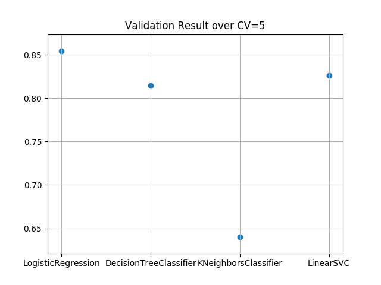

## Introduction
In this repository, I solved the simple classification problem using the scikit-learn. The dataset used here is the Titanic dataset distributed on Kaggle.

The objective of this analysis is to show how popular machine learning models can be applied to the well-known dataset and to decide an appropriate model which can predict whether or not people would have survived the Titanic disaster.

## Dependencies
`pip install -r requirements.txt`

## Models
- LogisticRegression
- DecisionTreeClassifier
- KNeighborsClassifier
- LinearSVC

## Preprocessing

## Result

